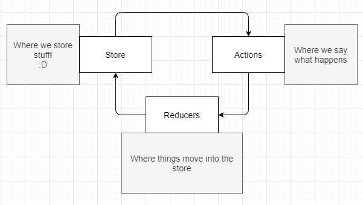

I'm writing a small series of posts on Redux, specifically with React. I've been using it for a while. I'm also still learning it--_which seems like a never ending process with React_. I hope to make it easier for others to use it by focusing on the practical pieces. So, I'll focus on two major questions:

- How do you get it to work?
- What is it doing?

## Redux Data Flow

At it's core Redux is simplistic. We have three "things" to consider: a store, an action, a reducer. Those names might sound weird though. Let's briefly walk through some theory.

- Store: This is where we, well, _store_ things.
- Action: Something happened, and we're describing it.
- Reducer: Weird name. This is how we put stuff back into the store. (That name comes from the JavaScript function `reduce`, I'll explain later.)

Let's start with a simple flow diagram.



### Store: where the data is

First, a store is defined for an app.  In theory, it's just this. Yup, an object.

```
{
    data,
    data...
}
```

Here's an excerpt from the Redux docs.

[https://redux.js.org/api/createstore](https://redux.js.org/api/createstore)

### Actions: what we do
### Reducers: how data gets back to the _store_


I tried to read the documentation (didn't understand, so I skimmed...). I read dozens of articles, each explaining and re-explaining in their own way. Still difficult. Until I realized, I was always trying to answer this simple question:

> If I have `var x` here, and it turns into `var y` there. Where did that happen?

## Pin the tail on the function

So, if we have our three pieces (store, action, and reducer) then how does the data move around? This is what I call _pin the tail on the function_. Or, "if `you're` here, then how do `you` get there?"

> It really doesn't have a cute name. I just needed something to keep the theme of the blog article going.


<hr />

#### Old Ideas for post

Starting to learn Redux can feel daunting. React already has enough moving parts. Redux is yet another "thing". _Why are there so many things?!_

_I just want to write my app and store data...okay!!_ Just me? Oh, okay.

Redux can be daunting. It builds on top of a simple idea from React: one-way data flow. 

<hr />